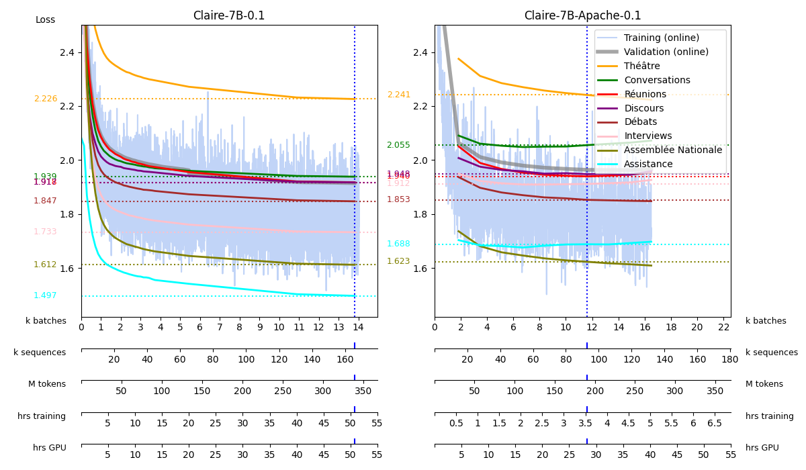
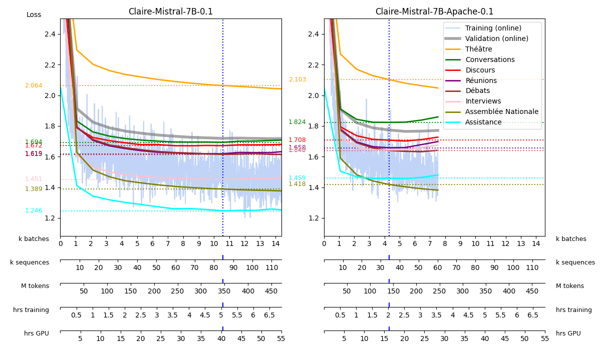

# Convergence curves of Claire models

## version 0.1

### Continual pretraining from Falcon-7b

* Left: on all data, on 1 GPU
* Right: on data with open licenses, on 8 GPUs

### Continual pretraining from Mistral-7B-v0.1

* Left: on all data
* Right: on data with open licenses

both on 8 GPUs

### Comparison

